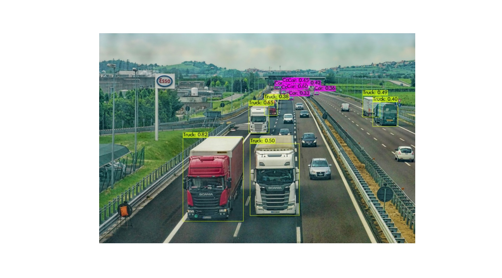
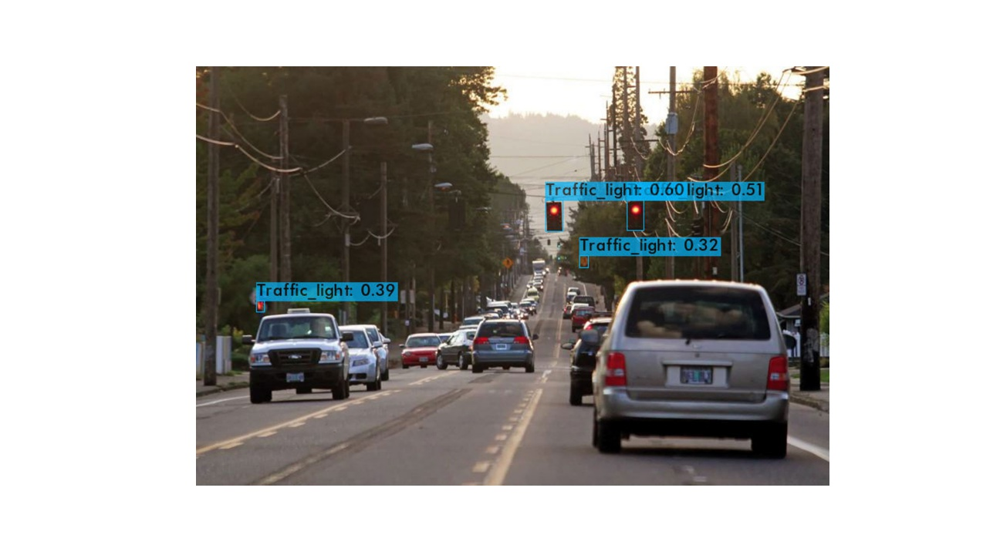

<h1 align="center">Fine-tune YOLOv4 for Traffic Object Detection</h1> 

### Context
There are a lot of traffic congestion and road accidents that happen in the city due to a lack of planning and understanding of the usage of the traffic in different situations. The idea is to collect useable data about traffic in a given city and understand the types of vehicles and traffic signs on the street as well as traffic usage for better city road planning. 

### YOLO model
YOLO is an algorithm that uses neural networks to provide real-time object detection (Bochkovskiy et al, 2020). Unlike two-step algorithms - detecting possible object regions and classifying the objects in that region YOLO proposes the use of an end-to-end neural network that makes predictions of bounding boxes and class probabilities all at once. YOLO achieves state-of-the-art results beating other real-time object detection algorithms by a large margin and is suitable for our use case of traffic object detection.

### Code base
`Explore_COCO_Dataset.ipynb` - Data exploration and category details for the COCO dataset that was used to pre-train the YOLOv4 model

`YOLO_Traffic_Detection.ipynb` - Notebook that calculates the weights from existing pre-trained YOLO model for the custom classes specific for road traffic objects

`yolov4_webcam_traffic.ipynb` - Using the weights calulcated from previous step, use it to run the model on a webcam to check the results

### Results

